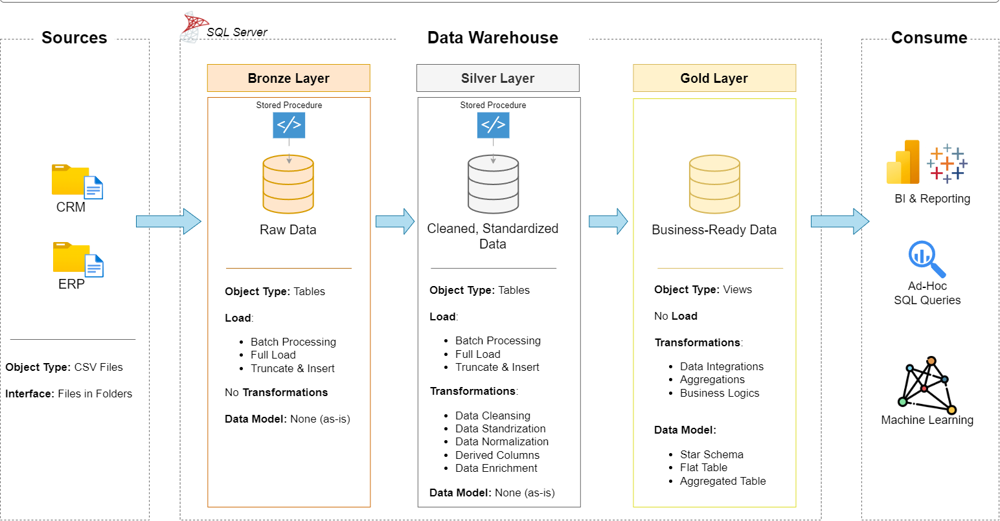

# 📊 Data Warehouse & Analytics Project

> **From raw CSV files to actionable business insights — a complete data engineering & analytics solution.**

Welcome to my **Data Warehouse & Analytics** portfolio project! 🚀
This repository demonstrates the end-to-end journey of **data ingestion, transformation, modeling, and reporting** using **industry-standard practices** in modern data engineering.

It’s designed to not only showcase my technical skills but also replicate a **real-world enterprise workflow** — using a **Medallion Architecture** layered design for clarity, scalability, and performance.

---

## 🏗 Data Architecture

This project follows the **Bronze → Silver → Gold** Medallion framework to manage data quality and readiness:



1. **Bronze Layer** – Raw, untouched data directly ingested from source CSVs (ERP & CRM systems) into SQL Server.
2. **Silver Layer** – Data cleansing, transformation, and normalization to standardize formats and remove inconsistencies.
3. **Gold Layer** – Business-ready **star schema** models optimized for BI reporting and analytical workloads.

---

## 📜 What This Project Covers

### **1. Data Engineering**

* Designing a **modern data warehouse** in SQL Server.
* Creating **ETL pipelines** for extracting, transforming, and loading data from multiple sources.
* Applying **data quality checks** to ensure accuracy and consistency.
* Building **fact & dimension tables** for analytical queries.

### **2. Business Intelligence**

* Writing **SQL queries** to generate actionable insights.
* Identifying **sales trends, customer behavior, and product performance**.
* Preparing datasets for **dashboard creation** (compatible with Power BI, Tableau, etc.).

---

## 🛠 Tools & Technologies

| Area                        | Tools Used                          |
| --------------------------- | ----------------------------------- |
| **Database**                | SQL Server Express                  |
| **ETL & SQL Development**   | SQL Server Management Studio (SSMS) |
| **Version Control**         | Git & GitHub                        |
| **Architecture & Modeling** | DrawIO                              |                            
| **Data Source**             | CSV files (ERP & CRM datasets)      |

---

## 🚀 Project Workflow

### **Phase 1 – Data Warehouse Development**

* Ingest CSV datasets from ERP & CRM into **Bronze layer** tables.
* Clean, transform, and standardize datasets into the **Silver layer**.
* Build analytical **Gold layer** models using a **star schema** design.

### **Phase 2 – Analytics & Insights**

* Write SQL queries to answer **business questions**.
* Generate insights such as:

  * Which products drive the most revenue?
  * Which customers are most valuable?
  * How do sales trends change over time?

---

## 📂 Repository Structure

```
data-warehouse-project/
│
├── datasets/                # Raw ERP and CRM datasets
├── docs/                    # Documentation & diagrams
│   ├── data_architecture.drawio
│   ├── etl.drawio
│   ├── data_flow.drawio
│   ├── data_catalog.md
│   ├── naming-conventions.md
├── scripts/                 # SQL scripts for ETL & transformations
│   ├── bronze/
│   ├── silver/
│   ├── gold/
├── tests/                   # Data validation scripts
├── README.md                # Main project overview
├── LICENSE
├── .gitignore
└── requirements.txt
```

---

## 📈 Sample Insights from the Project

Here are a few types of insights this warehouse can generate:

* 📌 **Customer Segmentation** – Identify high-value customers and target retention strategies.
* 📌 **Product Analysis** – Detect bestsellers and underperformers.
* 📌 **Sales Forecasting** – Spot trends and predict future sales opportunities.

---

## 💡 Why This Project Matters

This project replicates a **real-world enterprise data environment**, covering:

* Data ingestion from **multiple sources**
* ETL pipeline creation and **data quality enforcement**
* Designing **scalable data models** for BI tools
* Extracting **business insights** that drive decision-making

---
